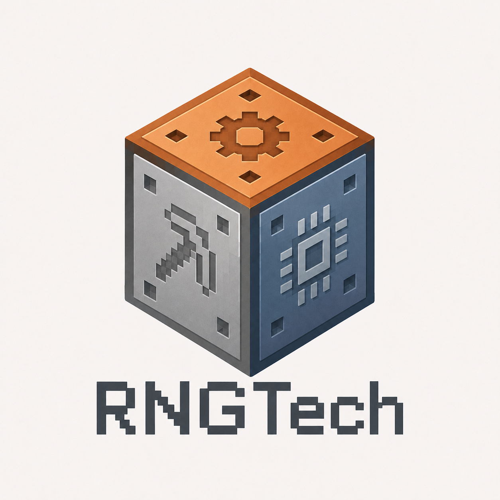

    

    <b>A tech mod where your machines drop like loot.</b> 
    Rarity, affixes, a crafting budget, and a passive tree for every machine in your factory.

    
    
    
    
    
    

    

RNGTech is a **Minecraft 1.21.1 / NeoForge** technology mod where every machine you craft is a loot drop. Each one rolls a rarity and a set of affixes, so two Crushers from the same recipe rarely match. Keep the good rolls, refine them, and level them up as you work through nine material stages, from flint tools to exotic alloys.

## What makes it different

- **Machines roll like loot.** Machines, Gear parts, Battery Cells, tool parts, and companions roll Normal, Magic, or Rare rarity with tiered prefixes and suffixes. A machine's chassis sets its limits; the Gear installed inside it does the work. [Rarity and Affixes →](https://c-pettersson.github.io/rngtech/rarity-and-affixes/)
- **Crafting with a budget.** Each item rolls Refinement Potential. Crystals, catalysts, and coils add, upgrade, reroll, or remove affixes, and every change spends RP, so no item can be pushed forever. [Affix Forge →](https://c-pettersson.github.io/rngtech/affix-forge/)
- **A passive tree for your machines.** Machines earn XP from real work and spend points on a shared 1,346-node tree with attributes, notables, and keystones. Ascendancy Seals unlock a specialization per machine family, and build codes copy a tree to the next machine. [Machine Mastery →](https://c-pettersson.github.io/rngtech/machine-mastery/)
- **Swap parts as you progress.** Put a better Crush Head or Heat Core into the machine you already have. One cheap Universal Cable carries power, fluids, and items, and the connector modules on it set the limits. [Universal Cable →](https://c-pettersson.github.io/rngtech/universal-cable/)
- **Grounded tech progression.** Crushing, smelting, alloying, metal forming, recycling, calibration, fluid and gas chemistry, nine kinds of generators, modular field tools, a Miner's Companion, and a rail-riding Forestry Companion.

The rarity, crafting currency, and passive-tree ideas come from **Path of Exile** and **Last Epoch**, applied to machines instead of characters. RNGTech uses its own names, mechanics, and artwork, and is not affiliated with or endorsed by Grinding Gear Games or Eleventh Hour Games.

## Get started

1. Install Minecraft **1.21.1** with **NeoForge 21.1.228 or newer** and **Java 21**. Fabric and Forge are not supported.
2. Download the JAR from [CurseForge](https://www.curseforge.com/minecraft/mc-mods/rngtech) and put it in the `mods` folder of the client and the server.
3. Follow [Getting Started](https://c-pettersson.github.io/rngtech/getting-started/) on the player wiki.

> [!NOTE]
> **2.0 is in alpha.** The shared passive tree and ascendancies are in the 2.0 alpha files on CurseForge's Files tab; the default release file is still 1.2.0. Unique items and Corruption arrive later in 2.0.

RNGTech is in active development. Back up your worlds before updating.

**Optional integrations:** [JEI](https://www.curseforge.com/minecraft/mc-mods/jei) (recipes and Gear lookup), [Jade](https://www.curseforge.com/minecraft/mc-mods/jade) (machine overlays), [AE2](https://www.curseforge.com/minecraft/mc-mods/applied-energistics-2) and [Refined Storage](https://www.curseforge.com/minecraft/mc-mods/refined-storage) (network bridges over Universal Cable). Pack authors can add the [FTB Quests extra](extras/ftbquests/README.md).

## Links

- [Player wiki](https://c-pettersson.github.io/rngtech/)
- [Bug reports and support](SUPPORT.md)
- [Contributing](CONTRIBUTING.md), including building from source
- [Design documentation](docs/index.md)
- [Security reporting](SECURITY.md)

## License

RNGTech uses the [MIT License](LICENSE). Minecraft, NeoForge, and optional mod dependencies keep their own licenses.
