# Tree Farm Automation

Status: Prototype

Tree Farm Automation is the first code-backed rail forestry slice. It is centered on the Forestry Companion, an independent `rngtech:forestry_cart` entity that travels vanilla rails, carries saplings, harvested cargo, onboard FE, cart Gear, managed planting cells, and active harvest snapshots. A Companion Station (`rngtech:forestry_cart_station`) is only a physical dock for supply loading, output unloading, FE and water charging, spare-tool installation, and optional hold-at-dock behavior.

## Current Runtime Surface

| Resource id | Runtime class | Menu / screen | Capabilities | Refinement |
|---|---|---|---|---|
| `rngtech:forestry_cart_station` | `ForestryCartStationBlockEntity` | `ForestryCartStationMenu` / `ForestryCartStationScreen` | Connector-gated plantable and shears input, output extraction, FE input, and water input | No |
| `rngtech:forestry_cart` | `ForestryCartEntity` / `ForestryCartItem` | `ForestryCartMenu` / `ForestryCartScreen` | Internal supply/output cargo, a water tank, and cart-owned Battery Cell, modular tool, shears, and Fluid Pump Gear; no block or item capability | Yes, item stack through Affix Forge |

Right-clicking a Forestry Companion opens its Cart, Stats, and Mastery tabs. While at least one player has the cart menu open, the cart enters `MANAGED`, stops rail movement, and pauses forestry work. Closing the final cart viewer returns the cart to normal FSM evaluation. Any player can open and manage the cart; the owner stored on player-placed carts is used only for FakePlayer harvest attribution and protection checks.

Forestry Companion enters the [shared Machine Mastery tree](../systems/machine-mastery.md) at Control / Drive. Its progression survives placement, pick-block, and broken-cart drops. Successful planting, leaf cleanup, and log harvesting award band-scaled XP. Travel attributes, work speed, route FE use, log limits, and managed territory provide overlapping numerical choices. Other families' nodes remain selectable and identify inactive effects.

Forestry behaviors include Magnet Mode, Serrated Leaf Protocol, Manual Throttle, Coasting Clutch, and Seedling Magnet. Clear Cutting adds 10 Tree Fell Limit with 20% less Processing Speed. Managed Territory, Wide Canopy, Grove Survey, and Orchard Plan each add eight managed cells. The shared page defines progression, attribute conversions, refunds, copy/paste, and automatic allocation. Existing 100-node Forestry allocations are refunded on migration while XP and earned levels remain.

The station screen has Station, Supply, Gear, and Stats tabs. The Station tab holds the six station output slots, the station water and FE gauges, station status/action indicators, and the hold-at-station toggle. The Supply tab holds a 3×3 plantables buffer and a Refills row (bone meal, spare tool, spare shears) with the bone meal store bar. Empty supply slots show a faded example item and a hover hint, and Gear slots show the shared Gear hints. A docked Seed Library cart gets the species its waiting cells need first; the station makes room by moving supply nobody waits for into its plantables buffer, and, while the station still stocks a species the cells wait for, tops up only species the cart already carries. When it stocks none of them, any plantable tops the cart up, so new and unremembered cells can still be planted. The Stats tab adds the water store and, while a cart is docked, its energy, Work Range, cells waiting for a species, and tool condition or water. The plantables slot takes saplings and Field Hand crops; bone meal goes in its own slot and drains into the 256 bone meal store. A spare Axe or Treefeller is installed in a docked tree-working cart whose tool is missing or broken, and the broken tool goes to the station outputs; nothing is swapped while the outputs are full. The Gear tab edits the station's optional Battery Cell, Energy Connector, Item Connector, and Fluid Connector ports. Stations do not store a cart UUID, do not show a remote cart UI, and do not own forestry workflow state.

## Route Behavior

The cart works on any valid vanilla rail route without needing a station. It keeps a route direction, follows rail shapes, and reverses at dead ends when the rail shape allows it. Manual Throttle adds a Cart-tab speed toggle; when enabled, powered travel uses faster route and transfer-seeking speeds but multiplies movement FE by `4x`. Coasting Clutch raises the no-power travel speed so an empty cart can keep rolling toward a station more reliably. If the cart leaves rails, it enters `OFF_RAIL` and stops forestry work until it is back on a valid rail. If the current or next rail clearance space is physically blocked, it enters `PATH_BLOCKED`. On ascending rails the clearance also covers the block above the slope, which the cart passes through while climbing or descending; players in that clearance report a dedicated player-blocking action, leaf blocks in that clearance path are removed through the same owner-attributed FakePlayer break path used for harvesting, and other blocking blocks keep the cart stopped until the path is cleared. The rendered cart screen swaps small action faces for movement, transfer, scanning, snapshot creation, chopping leaves, chopping logs, planting, blocked, and setup states.

If cargo is full or FE is needed, the cart enters `SEEKING_TRANSFER` and skips planting and harvesting while it moves along the route looking for a station dock. Empty sapling cargo does not block route progress or harvesting; it only prevents the cart from entering `PLANTING` until dock loading or harvested drops refill sapling cargo. If no station is present, the cart keeps operating as far as its onboard cargo and energy allow; it never requires station linking or station configuration.

When a station is physically beside the cart's current rail, the station can load saplings into the cart's sapling cargo, load staged shears into an empty cart shears slot, unload harvested output cargo into station output slots, and charge the cart Battery Cell from station FE. A cart remains stopped while docked until its cart Battery Cell is fully charged. A cart with empty sapling cargo can also pause for queued station sapling loading while docked, then leaves after the station sapling feed has been idle for `20` ticks; it does not require both onboard sapling slots to fill. If hold-at-station is enabled, the cart enters `DOCKED_HELD` and remains stopped until the station is released.

## Cart FSM Diagram

The cart owns the forestry workflow state. Each server tick re-evaluates the guards in this order; states that do work usually stop the cart for that tick, set a cooldown, or hand off to transfer seeking.

```mermaid
flowchart TD
    Tick(("Server tick"))

    Managed["MANAGED<br/>Cart menu open<br/>movement and work paused"]
    OffRail["OFF_RAIL<br/>No rail at cart or below"]
    DockedHeld["DOCKED_HELD<br/>Station hold toggle active"]
    SetupBlocked["SETUP_BLOCKED<br/>Missing Battery Cell, missing tool,<br/>invalid tool, or broken tool"]
    DockedTransfer["DOCKED_TRANSFER<br/>Physical station service while stopped"]
    SeekingTransfer["SEEKING_TRANSFER<br/>Needs output space or FE<br/>moves at transfer-seeking speed"]
    Moving["MOVING<br/>Follow vanilla rails"]
    RouteBlocked["ROUTE_BLOCKED<br/>No connected rail exit"]
    PathBlocked["PATH_BLOCKED<br/>Current or next rail clearance blocked<br/>players stop, leaves are cleared if possible"]
    WorkCooldown["WORK_COOLDOWN<br/>Wait after plant, log cut,<br/>leaf cut, or Treefeller batch"]
    SnapshotRange{"Active snapshot<br/>still beside cart?"}
    ScanningPower{"Can spend<br/>scan FE?"}
    Scanning["SCANNING<br/>Check left and right work roots"]
    CreatingSnapshot["CREATING_SNAPSHOT<br/>Build bounded leaf/log snapshot"]
    HarvestLeaves["HARVESTING_LEAVES<br/>Remove queued leaves first<br/>shears collect normal drops"]
    HarvestLogs["HARVESTING_LOGS<br/>Axe cuts one log;<br/>Treefeller batches logs"]
    Planting["PLANTING<br/>Plant sapling into empty<br/>track-adjacent root"]

    Tick -->|"cart UI has viewers"| Managed
    Managed -->|"final viewer closes"| Tick

    Tick -->|"no rail position"| OffRail
    OffRail -->|"back on rail"| Tick

    Tick -->|"docked station has hold enabled"| DockedHeld
    DockedHeld -->|"hold released or cart leaves dock"| Tick

    Tick -->|"setup guard fails"| SetupBlocked
    SetupBlocked -->|"Battery Cell and valid unbroken tool installed"| Tick

    Tick -->|"docked and waiting for queued saplings,<br/>output unload, or recharge"| DockedTransfer
    DockedTransfer -->|"blocking transfer solved,<br/>or sapling loading completes"| Tick

    Tick -->|"transfer status is not ready<br/>and no dock can satisfy it"| SeekingTransfer
    SeekingTransfer -->|"station dock reached"| DockedTransfer
    SeekingTransfer -->|"transfer no longer needed"| Tick
    SeekingTransfer -->|"driveOnRails finds no exit"| RouteBlocked
    SeekingTransfer -->|"driveOnRails finds blocked path"| PathBlocked

    Tick -->|"current rail is a curve"| Moving
    Moving -->|"driveOnRails finds no exit"| RouteBlocked
    Moving -->|"driveOnRails finds blocked path"| PathBlocked
    RouteBlocked -->|"rail path repaired or direction can reverse"| Tick
    PathBlocked -->|"leaf cleared or path repaired"| Tick

    Tick -->|"workCooldown > 0"| WorkCooldown
    WorkCooldown -->|"cooldown decremented to 0"| Tick

    Tick -->|"active harvest snapshot exists"| SnapshotRange
    SnapshotRange -->|"no: clear snapshot,<br/>report out of range, drive"| Moving
    SnapshotRange -->|"yes and leaves remain"| HarvestLeaves
    SnapshotRange -->|"yes and no leaves,<br/>logs remain"| HarvestLogs
    SnapshotRange -->|"yes but queues empty"| ScanningPower

    Tick -->|"no active snapshot"| ScanningPower
    ScanningPower -->|"no"| SeekingTransfer
    ScanningPower -->|"yes: spend scan FE"| Scanning

    Scanning -->|"adjacent log base found"| CreatingSnapshot
    CreatingSnapshot -->|"snapshot created"| SnapshotRange
    CreatingSnapshot -->|"no tree in bounded scan"| Scanning

    HarvestLeaves -->|"worked"| WorkCooldown
    HarvestLeaves -->|"no power or output full"| SeekingTransfer
    HarvestLeaves -->|"protection/tool/break blocked"| HarvestLeaves

    HarvestLogs -->|"worked"| WorkCooldown
    HarvestLogs -->|"no power or output full"| SeekingTransfer
    HarvestLogs -->|"protection/tool/break blocked"| HarvestLogs

    Scanning -->|"empty replaceable work root<br/>and sapling available"| Planting
    Planting -->|"worked"| WorkCooldown
    Planting -->|"no plant FE"| SeekingTransfer
    Planting -->|"blocked block, invalid soil,<br/>or placement failed"| Planting
    Planting -->|"root occupied, log base,<br/>sapling, or max cell limit"| Scanning

    Scanning -->|"scan complete"| Moving

    DockService["Station tick, external to cart FSM:<br/>unload cart outputs, charge cart Battery Cell,<br/>load queued saplings and replacement shears"]
    DockService -.-> DockedTransfer
```

## Planting And Harvesting

Each cart work pass scans the cells in its Work Range on both sides of the current rail. `WORK_RANGE` starts at one row, the blocks directly beside the rail, and reaches up to seven rows through Grove Warden's Nursery and the shared tree's Far Rows and Outer Rows; see [Machine Stats](../reference/machine-stats.md#ascendancy-stats). Scan FE scales with the rows worked. Empty cells can be planted with vanilla saplings from the cart's onboard sapling cargo, nearest row first. Only the first row reports Invalid Soil or Planting Blocked; outer rows over water, paths, or fences are skipped silently. Managed cells are stored on the cart with their root position and sapling id.

The managed-cell cap binds sooner on wider farms. At one row each rail block has 2 cells, so the base `96` cells fill after 48 rail blocks; at three rows each rail block has 6 cells and the cap fills after 16. When the cart scans a rail block it drops managed cells in that rail block's cross-section beyond the current Work Range that no longer hold a sapling, crop, or log, so shortening the range or moving a route frees the cap.

When the cart is beside a log base, managed or not, it builds one bounded snapshot from that base and separates it into ordered leaves and logs. The snapshot is persisted on the cart and limited to ordinary log and leaf blocks plus bounded scan sizes for safety. Connected logs are split between the trunks standing in them, so tightly planted rows and merged canopies are harvested one tree at a time. Every log resting on soil is a trunk base, as is a log on the scan floor with more trunk below it, such as a tree growing downhill of the track. Four bases in a 2x2 square with the log base form one trunk. Each connected log goes to the trunk base nearest horizontally, ties going to the tree being scanned, and a tree takes only the logs it reaches through its own share plus unowned pieces hanging from it. Leaves that touch another tree's logs wait for that tree. Logs past the scan bounds are left out instead of rejecting the tree. A snapshot accepts up to `512` logs regardless of the installed tool, so large oaks, 2x2 trees, and other big trees are worked down across as many actions as they need. A tree past that safety cap, or a connected log mass over `2048` logs, is skipped: its managed cell is marked blocked, the cart shows Tree Too Large, and it keeps driving and working other cells instead of stopping. The skipped tree is scanned again on later passes.

Harvesting uses a server FakePlayer block-break path tied to the cart owner's UUID and name when present. Ownerless legacy carts fall back to the shared server FakePlayer profile. The cart fires the normal block-break hook, clears queued snapshot leaves first, then cuts queued snapshot logs from the top down. Missing or externally changed snapshot targets are dropped from the queue instead of blocking the cart.

Logs crack over time before they are cut, with the vanilla block-breaking animation and hit sounds. Break time follows the block's hardness and the installed tool's speed against it, including Efficiency, like a player's: `hardness × 30 × 2 / (tool speed × Processing Speed)` ticks, at least `6`. An iron-speed axe cracks an ordinary log in about `24` ticks. After each cut the cart waits `4` ticks. Planting takes `30` ticks divided by Processing Speed, whatever the tool. Leaves keep the shear interval and show no cracks. Cracks clear if the snapshot is dropped, the tree leaves reach, the cart runs out of power, or the cart is removed; break progress is not saved, so a reloaded cart restarts its break.

Axes cut one top-down log per break. A Treefeller cracks its whole batch at once, taking the slowest log's break time multiplied by `1 + 0.35 × log2(batch size)`: a 16-log batch takes 2.4 times one log's time. Treefellers preflight cargo space, FE cost, tool validity, and protection checks for the current snapshot log batch, then cut those logs in one harvest action. A Treefeller batch costs `Cut FE * TREE_FELL_LIMIT`, even when fewer logs remain in the snapshot, and pauses for transfer if the cart Battery Cell cannot cover that full action cost. Tool wear is still applied by the block-break path for the logs actually broken. With usable shears installed on the cart, leaf removal collects normal vanilla leaf drops, allowing saplings to feed replanting. The cart charges shears wear after a successful collected leaf: vanilla-compatible shears lose one durability per `8` collected leaves, while staged RNGTech Pruning Shears use their material-specific leaf budget. Broken shears are consumed from the cart slot. Without usable shears, snapshot leaves are removed without drops unless Serrated Leaf Protocol is unlocked; that Mastery keystone collects normal no-shears leaf drops at `12x` the adjusted cut FE cost.

Sapling drops are routed into cart sapling cargo first; saplings that do not fit there overflow into onboard output cargo with apples, sticks, logs, and other harvested drops. Drops are prechecked against routed cargo space before breaking. Magnet Mode normally inserts picked-up item entities into output cargo only. If Seedling Magnet is also unlocked, picked-up saplings use the same sapling-cargo-first routing as harvested sapling drops. If onboard output cargo cannot fit the next drops, the cart seeks transfer before doing more destructive work.

## Energy And Automation

The station receives FE only when an Energy Connector is installed and stores a small internal buffer plus any installed station Battery Cell. While a Forestry Companion is physically docked, the station charges that cart's installed Battery Cell from station FE, capped by the installed Energy Connector or station Battery Cell output rate, and the cart waits at the dock until that Battery Cell is full. Route work draws from the cart Battery Cell. The cart does not recharge the installed modular tool; any installed tool Battery Cell remains the tool's normal optional FE path. If the cart runs out of FE, planting and harvesting pause, and rail movement continues at reduced unpowered speed so the cart can keep seeking transfer.

A powered cart moves `0.055` blocks per tick and seeks a station at `0.08`; Manual Throttle raises those to `0.095` and `0.12`. `CART_SPEED` multiplies them up to a `0.34` cap. The shared tree's Rail Pace pocket adds Cart Speed, and its Driven Wheels notable adds more per point of Drive. Open Track grants `IDLE_CART_SPEED`, extra Cart Speed once the cart has gone 4 seconds without planting, cutting, or harvesting a crop.

Forestry Companion item stacks use the `FORESTRY_COMPANION` modifier eligibility profile. Processing-speed affixes shorten break and planting times, and energy-usage affixes adjust movement, scan, plant, and cut FE costs. Placed carts save traits and Mastery progression, preserve them on pick-block, and drop the same rolled companion item when broken.

Control, Drive, and Reserve use the [shared attribute conversions](../systems/machine-mastery.md#attributes). Base class attributes now affect gameplay. The Forestry Companion also has two [ascendancies](#ascendancies).

Successful route actions consume cart FE:

| Action | Base cost before `ENERGY_USAGE` |
|---|---:|
| Cart movement tick | `1 FE`; Manual Throttle multiplies this adjusted cost by `4x` while enabled |
| Tree snapshot scan | `2 FE` |
| Plant sapling | `40 FE` |
| Cut one log or leaf | `80 FE`; Treefeller batches multiply this by the installed `TREE_FELL_LIMIT`; Serrated Leaf Protocol no-shears leaf drops cost `12x` adjusted cut FE |

Automation surfaces:

- Item automation requires an installed Item Connector; top insertion routes saplings and Field Hand crops to the plantables slot, bone meal to the bone meal slot, vanilla-compatible shears or RNGTech Pruning Shears to the shears slot, and Axes or Treefellers to the spare-tool slot. Bottom extraction pulls station outputs after dock unloading. Per-call transfer is capped by the installed Item Connector tier.
- FE automation requires an installed Energy Connector, charges the station buffer, optional station Battery Cell, and any physically docked cart, and is capped by the installed Energy Connector tier.
- Fluid automation requires an installed Fluid Connector. It fills the station's 16,000 mB water-only tank, capped per call by the connector tier; a docked Field Hand cart with the Sprinkler and a Fluid Pump draws water from it.
- Cart Battery Cell, modular tool, shears Gear, and onboard cargo are managed from the cart's own right-click menu. A station can only install staged shears into an empty docked-cart shears slot; it does not replace usable installed shears. The station Battery Cell and connector ports are managed from the station Gear tab.

## Ascendancies

Status: Prototype

Forestry Companion machines choose Timber Baron, the logger; Grove Warden, the generalist whose edge is growth pulses; or Field Hand, the farmer, when they use their first Ascendancy Seal. [Machine Mastery](../systems/machine-mastery.md#ascendancies) defines Seals, points, refunds, and switching, and [Machine Stats](../reference/machine-stats.md#ascendancy-stats) defines the new stats. The tables below are generated from the ascendancy catalog.

- A Forestry Companion has no chassis stage and always meets the Seal I entry gate, whatever Gear is installed, so a cart can become a Field Hand without ever holding an axe.
- Timber Baron’s Log Ledger banks Ledger Rate of each harvested log and pays whole logs into output cargo when there is room. Heartwood feeds Treefeller batches twice. Clearcut Charter stops planting and waiting for saplings, and routes sapling drops to output cargo.
- Rolling Harvest keeps the cart moving after planting and through work cooldowns, and cuts a tree while it stays within Work Range + 1 blocks of the rail (2 blocks at the base range). Cells the cart rolled past stay on its work list while they are within that reach, so trees and empty cells in a tight row are still cut and replanted. The cart halts only when the tree being cut, or a tree (or, under Rolling Reap, a ripe crop) still waiting to be harvested, would leave reach at the next rail block. Empty cells never hold it up. A rolling cart plants every empty cell in reach in one planting action (each sapling costs its usual FE), then for one plant interval moves at most one rail block per interval, so it reaches the next rail block as it is ready to plant again and rows come out even. With nothing to plant it rolls at full speed. Processing Speed shortens the plant interval, so it raises the planting stride.
- Grove Warden’s growth pulses spend bone meal, not FE alone, so FE never becomes wood. A Grove Warden cart stores up to 256 bone meal, loaded through its sapling slots or from a docked station. The station keeps its own 256 store, loaded through its sapling slot, so bone meal never blocks saplings. The cart and station show the store as a bar under the sapling slots.
- Each managed sapling takes at most one pulse per 100 ticks. A pulse that cannot grow a ready sapling, for lack of room or a single-tree form, backs that cell off for 1,200 ticks.
- Seed Library replants each cell’s remembered species and leaves the cell empty until that sapling is in cargo. A cell remembers whatever grows in it when the cart scans it, including a sapling or crop a player planted, and the cart takes such plants into its managed cells while the cap allows, so Seed Library replants what was actually there.
- With Seed Library or Seed Ledger, each cell keeps its own replant: when the cart harvests a cell, it sets aside one matching sapling or crop item from that cell's drops (four for an Ancient Grove plot) before routing the rest. Planting uses the cell's reserve before supply cargo, so a common species filling the two supply slots can no longer starve a rarer one. Reserves show as Reserved on the cart's Stats tab, return to cargo when a cell is pruned or its species changes, move to output when the cart leaves Seed Library, and drop when the cart breaks. A docked station loads the species that empty cells without a reserve are waiting for first. Ancient Grove plants a clear 2×2 plot away from the rail when four saplings from `rngtech:giant_saplings` are in cargo, on any row; its far squares may sit one row beyond Work Range. It costs four plantings of FE and counts as one managed cell.
- Nursery adds two rows of Work Range, and Spare Plots and Old Rows add 16 managed cells each. Verdant Surge pulses every managed sapling within Work Range + 1 blocks of the rail.
- Timber Baron's Greased Axles and Loose Brakes each add 15% Cart Speed.
- Field Hand's root, Field Rotation, plants crops from `rngtech:cart_crops` (wheat seeds, carrots, potatoes, and beetroot seeds by default) on farmland in Work Range, harvests them when fully grown, and replants them; it never plants saplings or cuts trees, and its supply slots take crop items only. Seeds and the replantable crops return to supply cargo; wheat and beetroot go to output. A harvest costs `20 FE` and gives 2 machine XP. Crop items left in supply after switching away from Field Hand move to output cargo.
- The Sprinkler needs a Fluid Pump in the cart's new pump Gear slot and water in its tank (8,000 mB, raised by Fluid Capacity from the shared tree's Reservoirs pockets or the installed pump's Brimming and Depth affixes), which a docked station fills from its own water tank as fast as the pump's rolled transfer rate allows. It spends 50 mB to till dirt or grass under an empty crop cell into wet farmland, or to wet farmland. Sprinkled farmland then counts as near water for 60 seconds (1,200 ticks), as if a water source were beside it, and the cart refreshes it for another 50 mB once half that time has passed. Irrigation reaches one more row, spends half the water, and keeps farmland watered 50% longer (90 seconds). While the sprinkler can work (pump installed, water in the tank, cart on a work rail), a sprinkler head spins on the cart's roof and its two nozzles throw water out to both sides, landing about the sprinkler's reach away. Hydration matches vanilla water nearby and adds no growth, so water and FE never become crops.
- Reap and Sow replants a harvested cell in the same action. Rolling Reap uses Rolling Harvest's roll rules for crop cells. Seed Ledger is Seed Library for crop cells.

<!-- ascendancy-trees:start -->

### Timber Baron

| Node | Type | After | Effect |
|---|---|---|---|
| **Log Ledger** | Root | — | +10% Ledger Rate. Harvested logs bank Ledger Rate of themselves and pay whole logs into cargo; leaf cleanup is 25% slower. |
| Long Reach | Small | Log Ledger | +2 Tree Fell Limit. |
| **Sawyer’s Eye** | Notable | Long Reach | +5 Tree Fell Limit. |
| Broad Reach | Small | Sawyer’s Eye | +2 Tree Fell Limit. |
| **Clearcut Charter** | Deep notable | Broad Reach | +15% Ledger Rate. The cart stops planting and sends saplings to output cargo. |
| Lean Cut | Small | Log Ledger | 5% reduced Energy Use. |
| **Clean Fell** | Notable | Lean Cut | Treefeller batches cost FE only for the logs cut, not the full Tree Fell Limit. |
| Greased Axles | Small | Log Ledger | 15% increased Cart Speed. |
| **Dock Sprint** | Notable | Greased Axles | +50% Cart Speed while heading to a station. |
| Loose Brakes | Small | Dock Sprint | 15% increased Cart Speed. |
| **Rolling Harvest** | Deep notable | Loose Brakes | The cart keeps rolling while it plants and waits out work, and cuts trees within Work Range + 1 blocks of the rail. It plants every empty cell in reach in one action, then slows to one rail block per planting. |
| Tally Board | Small | Log Ledger | +3% Ledger Rate. |
| **Heartwood** | Notable | Tally Board | Logs cut in one Treefeller batch feed the Log Ledger twice. |

### Grove Warden

| Node | Type | After | Effect |
|---|---|---|---|
| **Growth Pulse** | Root | — | +1 Growth Pulse. As the cart passes a managed sapling, a growth pulse spends 1 bone meal and 30 FE. Load bone meal through the sapling slots of the cart or its station. Movement costs 25% more FE. |
| Spare Plots | Small | Growth Pulse | +16 managed cells. |
| **Nursery** | Notable | Spare Plots | +2 rows Work Range. |
| Old Rows | Small | Nursery | +16 managed cells. |
| **Ancient Grove** | Deep notable | Old Rows | With four matching saplings in cargo, plants a 2×2 giant dark oak, jungle, or spruce away from the rail. |
| Loam | Small | Growth Pulse | 10% increased Growth Pulse. |
| **Rich Soil** | Notable | Loam | 50% increased Growth Pulse. |
| Deep Roots | Small | Rich Soil | 10% increased Growth Pulse. |
| **Verdant Surge** | Deep notable | Deep Roots | Growth pulses reach every managed sapling within Work Range + 1 blocks of the rail. |
| Seed Drawers | Small | Growth Pulse | 5% reduced Energy Use. |
| **Seed Library** | Notable | Seed Drawers | Each managed cell replants the species it last grew, and waits until that sapling is in cargo. |
| Light Touch | Small | Growth Pulse | 5% increased Processing Speed. |
| **Canopy Care** | Notable | Light Touch | Shears wear half as fast. |

### Field Hand

| Node | Type | After | Effect |
|---|---|---|---|
| **Field Rotation** | Root | — | +1 row Work Range. Plants seeds, carrots, and potatoes from supply cargo on farmland in Work Range, harvests fully grown crops, and replants them. The cart never plants saplings or cuts trees, and needs no cutting tool. |
| Furrow Cells | Small | Field Rotation | +16 managed cells. |
| **Wide Furrows** | Notable | Furrow Cells | +1 row Work Range. |
| Long Furrows | Small | Wide Furrows | +16 managed cells. |
| **Open Fields** | Deep notable | Long Furrows | +1 row Work Range; +32 managed cells. |
| Hose Fittings | Small | Field Rotation | 25% increased Fluid Capacity. |
| **Sprinkler** | Notable | Hose Fittings | With a Fluid Pump installed, spends 50 mB of tank water to till dirt or grass under an empty crop cell or to wet farmland, which then stays watered for 60 seconds. Passing again refreshes it. |
| Wide Nozzles | Small | Sprinkler | 25% increased Fluid Capacity. |
| **Irrigation** | Deep notable | Wide Nozzles | The sprinkler reaches one more row, spends half the water, and keeps farmland watered 50% longer. |
| Sharp Sickle | Small | Field Rotation | 5% increased Processing Speed. |
| **Reap and Sow** | Notable | Sharp Sickle | Replants a harvested crop cell in the same action. |
| Quick Wheels | Small | Reap and Sow | 10% increased Cart Speed. |
| **Rolling Reap** | Deep notable | Quick Wheels | The cart keeps rolling while it harvests crops, plants, and waits out work, within Work Range + 1 blocks of the rail. |
| Seed Bins | Small | Field Rotation | +16 managed cells. |
| **Seed Ledger** | Notable | Seed Bins | Each managed cell replants the species it last grew, and waits until that sapling is in cargo. |

<!-- ascendancy-trees:end -->

## Current Limits

- The station has no dedicated machine modifier profile and is not a refinement target yet.
- The cart cargo is internal to the entity and has no external item capability.
- Cart owner data is attribution-only; access control is not implemented.
- The cart Battery Cell charges only while physically docked at a station.
- The tree snapshot targets normal logs and leaves and does not support canopy shaping, drones, gantries, or arbitrary modded tree logic.

## Related Pages

- [Current Implementation Matrix](../reference/current-implementation.md)
- [Modular Field Tools](modular-field-tools.md)
- [Battery Cells](battery-cells.md)
- [Bio Generator](bio-generator.md)
