# Tree Farm Automation

Status: Prototype

Tree Farm Automation is the first code-backed rail forestry slice. It is centered on the Forestry Companion, an independent `rngtech:forestry_cart` entity that travels vanilla rails, carries saplings, harvested cargo, onboard FE, cart Gear, managed planting cells, and active harvest snapshots. A `rngtech:forestry_cart_station` is only a physical dock for sapling loading, output unloading, FE charging, and optional hold-at-dock behavior.

## Current Runtime Surface

| Resource id | Runtime class | Menu / screen | Capabilities | Refinement |
|---|---|---|---|---|
| `rngtech:forestry_cart_station` | `ForestryCartStationBlockEntity` | `ForestryCartStationMenu` / `ForestryCartStationScreen` | Connector-gated sapling and shears input, output extraction, FE input, and placeholder fluid endpoint | No |
| `rngtech:forestry_cart` | `ForestryCartEntity` / `ForestryCartItem` | `ForestryCartMenu` / `ForestryCartScreen` | Internal sapling/output cargo and cart-owned Battery Cell, modular tool, and shears Gear; no block or item capability | Yes, item stack through Affix Forge |

Right-clicking a Forestry Companion opens its Cart, Stats, and Mastery tabs. While at least one player has the cart menu open, the cart enters `MANAGED`, stops rail movement, and pauses forestry work. Closing the final cart viewer returns the cart to normal FSM evaluation. Any player can open and manage the cart; the owner stored on player-placed carts is used only for FakePlayer harvest attribution and protection checks.

Forestry Companion Mastery is stored on the cart item stack through `rngtech:machine_progression`, survives placement, pick-block, and broken-cart drops, and grants XP from successful planting, leaf cleanup, and log harvest actions. The fixed passive tree improves route FE use, work speed, accepted tree log limits, and managed-cell capacity. Forestry is the first tree backed by the typed PoE-style passive tree definition: `100` total nodes, with `48` attribute-only travel nodes, `32` specialization nodes, `14` notables, `5` keystones, and `1` starter. Travel nodes use unique internal enum ids for saves, links, and effects, but display as `Attribute` in the UI and only grant Control, Drive, or Reserve. Non-travel specialization nodes carry managed-cell unlocks and cluster-local forestry choices. The layout is drawn as a three-exit starter, a pure three-node travel runway, non-overlapping local clusters, short cross-travel rungs, optional notable pockets, outer route choices, and single-link keystone endpoints rather than reward-specific sections, so a player chasing one stat such as work speed can still expand through several directions of the tree. Keystone Masteries are scattered around the outer edges as build-defining endpoints. Control improves cart stability and route FE use; Drive improves work interval and adds accepted-log capacity at higher totals; Reserve improves endurance through managed-cell headroom. Forestry Companion passive nodes are gated by passive points and connected path traversal rather than by machine level requirements, and the tree has more spendable nodes than a max-level cart can unlock. Its behavior keystones include Magnet Mode, which pulls nearby dropped item entities into onboard output cargo, Serrated Leaf Protocol, which allows leaf drops without shears at a much higher FE cost, Manual Throttle, which unlocks a player-toggled fast travel mode, Coasting Clutch, which improves no-power rail speed, and Seedling Magnet, which lets Magnet Mode refill sapling cargo before output cargo.

Processing-oriented Mastery is intentionally split into three packages instead of one cardinal speed lane:

| Package | Core nodes | Best use | Gives up |
|---|---|---|---|
| Raw overdrive | Light Axle, Fast Planter, Saw Rhythm, Advance Timer, Planting Servo, Logger Feed Rollers, Cut Order Routine, Hot-Swap Routine, and Forestry Overdrive | Highest work-interval pressure when FE supply is oversized | FE efficiency, reserve headroom, managed cells, and output routing |
| Sustained control | Route Survey, Low-Loss Wheels, Conservation Loop, Energy Dispatch Table, Brake Recovery Loop, the coasting route, Cell Tender Matrix, and Grove Registry | Long-running routes that need speed without frequent transfer stops | Peak burst speed and broad-tree support |
| Broad/output throughput | Root Mapping, Canopy Profile, Heavy Saw Frame, Broad Tree Protocol, Forest Loop, Depot Sorter, Canopy Workplan, and Stormfall Protocol | Larger trees, higher logs-per-action value, and output-oriented routes | Raw cycle speed, FE margin on the widest packages, and automation flexibility |

These packages share little of their non-starter path. The raw and broad packages only touch at the early Light Axle branch in their shortest routes, while the sustained package can stay on the route-control and managed-cell side of the tree. High-processing notables are placed beside non-processing alternatives such as scan control, reserve travel, energy dispatch, managed cells, bin partitions, or canopy safety so the processing answer is a build choice rather than a single lane.

The station screen has Station, Gear, and Stats tabs. The Station tab stores one sapling staging input, one cart shears staging input, six station output slots, the station FE gauge, station status/action indicators, and the hold-at-station toggle. The Gear tab edits the station's optional Battery Cell, Energy Connector, Item Connector, and Fluid Connector ports. Stations do not store a cart UUID, do not show a remote cart UI, and do not own forestry workflow state.

## Route Behavior

The cart works on any valid vanilla rail route without needing a station. It keeps a route direction, follows rail shapes, and reverses at dead ends when the rail shape allows it. Manual Throttle adds a Cart-tab speed toggle; when enabled, powered travel uses faster route and transfer-seeking speeds but multiplies movement FE by `4x`. Coasting Clutch raises the no-power travel speed so an empty cart can keep rolling toward a station more reliably. If the cart leaves rails, it enters `OFF_RAIL` and stops forestry work until it is back on a valid rail. If the current or next rail clearance space is physically blocked, it enters `PATH_BLOCKED`; players in that clearance report a dedicated player-blocking action, leaf blocks in that clearance path are removed through the same owner-attributed FakePlayer break path used for harvesting, and other blocking blocks keep the cart stopped until the path is cleared. The rendered cart screen swaps small action faces for movement, transfer, scanning, snapshot creation, chopping leaves, chopping logs, planting, blocked, and setup states.

If cargo is full or FE is needed, the cart enters `SEEKING_TRANSFER` and skips planting and harvesting while it moves along the route looking for a station dock. Empty sapling cargo does not block route progress or harvesting; it only prevents the cart from entering `PLANTING` until dock loading or harvested drops refill sapling cargo. If no station is present, the cart keeps operating as far as its onboard cargo and energy allow; it never requires station linking or station configuration.

When a station is physically beside the cart's current rail, the station can load saplings into the cart's sapling cargo, load staged shears into an empty cart shears slot, unload harvested output cargo into station output slots, and charge the cart Battery Cell from station FE. A cart remains stopped while docked until its cart Battery Cell is fully charged. A cart with empty sapling cargo can also pause for queued station sapling loading while docked, then leaves after the station sapling feed has been idle for `20` ticks; it does not require both onboard sapling slots to fill. If hold-at-station is enabled, the cart enters `DOCKED_HELD` and remains stopped until the station is released.

## Cart FSM Diagram

The cart owns the forestry workflow state. Each server tick re-evaluates the guards in this order; states that do work usually stop the cart for that tick, set a cooldown, or hand off to transfer seeking.

```mermaid
flowchart TD
    Tick(("Server tick"))

    Managed["MANAGED<br/>Cart menu open<br/>movement and work paused"]
    OffRail["OFF_RAIL<br/>No rail at cart or below"]
    DockedHeld["DOCKED_HELD<br/>Station hold toggle active"]
    SetupBlocked["SETUP_BLOCKED<br/>Missing Battery Cell, missing tool,<br/>invalid tool, or broken tool"]
    DockedTransfer["DOCKED_TRANSFER<br/>Physical station service while stopped"]
    SeekingTransfer["SEEKING_TRANSFER<br/>Needs output space or FE<br/>moves at transfer-seeking speed"]
    Moving["MOVING<br/>Follow vanilla rails"]
    RouteBlocked["ROUTE_BLOCKED<br/>No connected rail exit"]
    PathBlocked["PATH_BLOCKED<br/>Current or next rail clearance blocked<br/>players stop, leaves are cleared if possible"]
    WorkCooldown["WORK_COOLDOWN<br/>Wait after plant, log cut,<br/>leaf cut, or Treefeller batch"]
    SnapshotRange{"Active snapshot<br/>still beside cart?"}
    ScanningPower{"Can spend<br/>scan FE?"}
    Scanning["SCANNING<br/>Check left and right work roots"]
    CreatingSnapshot["CREATING_SNAPSHOT<br/>Build bounded leaf/log snapshot"]
    HarvestLeaves["HARVESTING_LEAVES<br/>Remove queued leaves first<br/>shears collect normal drops"]
    HarvestLogs["HARVESTING_LOGS<br/>Axe cuts one log;<br/>Treefeller batches logs"]
    Planting["PLANTING<br/>Plant sapling into empty<br/>track-adjacent root"]

    Tick -->|"cart UI has viewers"| Managed
    Managed -->|"final viewer closes"| Tick

    Tick -->|"no rail position"| OffRail
    OffRail -->|"back on rail"| Tick

    Tick -->|"docked station has hold enabled"| DockedHeld
    DockedHeld -->|"hold released or cart leaves dock"| Tick

    Tick -->|"setup guard fails"| SetupBlocked
    SetupBlocked -->|"Battery Cell and valid unbroken tool installed"| Tick

    Tick -->|"docked and waiting for queued saplings,<br/>output unload, or recharge"| DockedTransfer
    DockedTransfer -->|"blocking transfer solved,<br/>or sapling loading completes"| Tick

    Tick -->|"transfer status is not ready<br/>and no dock can satisfy it"| SeekingTransfer
    SeekingTransfer -->|"station dock reached"| DockedTransfer
    SeekingTransfer -->|"transfer no longer needed"| Tick
    SeekingTransfer -->|"driveOnRails finds no exit"| RouteBlocked
    SeekingTransfer -->|"driveOnRails finds blocked path"| PathBlocked

    Tick -->|"current rail is a curve"| Moving
    Moving -->|"driveOnRails finds no exit"| RouteBlocked
    Moving -->|"driveOnRails finds blocked path"| PathBlocked
    RouteBlocked -->|"rail path repaired or direction can reverse"| Tick
    PathBlocked -->|"leaf cleared or path repaired"| Tick

    Tick -->|"workCooldown > 0"| WorkCooldown
    WorkCooldown -->|"cooldown decremented to 0"| Tick

    Tick -->|"active harvest snapshot exists"| SnapshotRange
    SnapshotRange -->|"no: clear snapshot,<br/>report out of range, drive"| Moving
    SnapshotRange -->|"yes and leaves remain"| HarvestLeaves
    SnapshotRange -->|"yes and no leaves,<br/>logs remain"| HarvestLogs
    SnapshotRange -->|"yes but queues empty"| ScanningPower

    Tick -->|"no active snapshot"| ScanningPower
    ScanningPower -->|"no"| SeekingTransfer
    ScanningPower -->|"yes: spend scan FE"| Scanning

    Scanning -->|"adjacent log base found"| CreatingSnapshot
    CreatingSnapshot -->|"snapshot created"| SnapshotRange
    CreatingSnapshot -->|"no tree in bounded scan"| Scanning

    HarvestLeaves -->|"worked"| WorkCooldown
    HarvestLeaves -->|"no power or output full"| SeekingTransfer
    HarvestLeaves -->|"protection/tool/break blocked"| HarvestLeaves

    HarvestLogs -->|"worked"| WorkCooldown
    HarvestLogs -->|"no power or output full"| SeekingTransfer
    HarvestLogs -->|"protection/tool/break blocked"| HarvestLogs

    Scanning -->|"empty replaceable work root<br/>and sapling available"| Planting
    Planting -->|"worked"| WorkCooldown
    Planting -->|"no plant FE"| SeekingTransfer
    Planting -->|"blocked block, invalid soil,<br/>or placement failed"| Planting
    Planting -->|"root occupied, log base,<br/>sapling, or max cell limit"| Scanning

    Scanning -->|"scan complete"| Moving

    DockService["Station tick, external to cart FSM:<br/>unload cart outputs, charge cart Battery Cell,<br/>load queued saplings and replacement shears"]
    DockService -.-> DockedTransfer
```

## Planting And Harvesting

Each cart work pass scans the cells one block to the left and right of the current rail. Empty cells can be planted with vanilla saplings from the cart's onboard sapling cargo. Managed cells are stored on the cart with their root position and sapling id.

When the cart is beside a log base, managed or not, it builds one bounded snapshot from that base and separates it into ordered leaves and logs. The snapshot is persisted on the cart and limited to ordinary log and leaf blocks plus bounded scan sizes for safety. The installed tool's connected-log cap is enforced during snapshot creation; over-limit trees are marked too large instead of being split across later actions.

Harvesting uses a server FakePlayer block-break path tied to the cart owner's UUID and name when present. Ownerless legacy carts fall back to the shared server FakePlayer profile. The cart fires the normal block-break hook, clears queued snapshot leaves first, then cuts queued snapshot logs from the top down. Missing or externally changed snapshot targets are dropped from the queue instead of blocking the cart.

Axes cut one top-down log per work interval. Treefellers preflight cargo space, FE cost, tool validity, and protection checks for the current snapshot log batch, then cut those logs in one harvest action. A Treefeller batch costs `Cut FE * TREE_FELL_LIMIT`, even when fewer logs remain in the snapshot, and pauses for transfer if the cart Battery Cell cannot cover that full action cost. Tool wear is still applied by the block-break path for the logs actually broken. With usable shears installed on the cart, leaf removal collects normal vanilla leaf drops, allowing saplings to feed replanting. The cart charges shears wear after a successful collected leaf: vanilla-compatible shears lose one durability per `8` collected leaves, while staged RNGTech Pruning Shears use their material-specific leaf budget. Broken shears are consumed from the cart slot. Without usable shears, snapshot leaves are removed without drops unless Serrated Leaf Protocol is unlocked; that Mastery keystone collects normal no-shears leaf drops at `12x` the adjusted cut FE cost.

Sapling drops are routed into cart sapling cargo first; saplings that do not fit there overflow into onboard output cargo with apples, sticks, logs, and other harvested drops. Drops are prechecked against routed cargo space before breaking. Magnet Mode normally inserts picked-up item entities into output cargo only. If Seedling Magnet is also unlocked, picked-up saplings use the same sapling-cargo-first routing as harvested sapling drops. If onboard output cargo cannot fit the next drops, the cart seeks transfer before doing more destructive work.

## Energy And Automation

The station receives FE only when an Energy Connector is installed and stores a small internal buffer plus any installed station Battery Cell. While a Forestry Companion is physically docked, the station charges that cart's installed Battery Cell from station FE, capped by the installed Energy Connector or station Battery Cell output rate, and the cart waits at the dock until that Battery Cell is full. Route work draws from the cart Battery Cell. The cart does not recharge the installed modular tool; any installed tool Battery Cell remains the tool's normal optional FE path. If the cart runs out of FE, planting and harvesting pause, and rail movement continues at reduced unpowered speed so the cart can keep seeking transfer.

Forestry Companion item stacks use the `FORESTRY_COMPANION` modifier eligibility profile. Processing-speed affixes adjust the placed cart's work interval after installed tool speed is considered, and energy-usage affixes adjust movement, scan, plant, and cut FE costs. Placed carts save traits and Mastery progression, preserve them on pick-block, and drop the same rolled companion item when broken.

Core stat conversions for the Forestry Companion:

| Core stat | Forestry Companion effect |
|---|---|
| `CONTROL` | `+1% STABILITY` per point and `1% reduced ENERGY_USAGE` per `5` points. |
| `DRIVE` | `+0.75% PROCESSING_SPEED` per point and `+1 TREE_FELL_LIMIT` per `10` points. |
| `RESERVE` | `+2` maximum managed cells per point. |

Crusher, Furnace, and Forestry Companion now have passive class metadata with base Control, Drive, and Reserve values plus a future-ready empty ascendancy list. In this branch those base class stats are metadata only and do not affect gameplay stats.

Successful route actions consume cart FE:

| Action | Base cost before `ENERGY_USAGE` |
|---|---:|
| Cart movement tick | `1 FE`; Manual Throttle multiplies this adjusted cost by `4x` while enabled |
| Tree snapshot scan | `2 FE` |
| Plant sapling | `40 FE` |
| Cut one log or leaf | `80 FE`; Treefeller batches multiply this by the installed `TREE_FELL_LIMIT`; Serrated Leaf Protocol no-shears leaf drops cost `12x` adjusted cut FE |

Automation surfaces:

- Item automation requires an installed Item Connector; top insertion accepts vanilla saplings into the station sapling staging slot and vanilla-compatible shears or RNGTech Pruning Shears into the station shears staging slot. Bottom extraction pulls station outputs after dock unloading. Per-call transfer is capped by the installed Item Connector tier.
- FE automation requires an installed Energy Connector, charges the station buffer, optional station Battery Cell, and any physically docked cart, and is capped by the installed Energy Connector tier.
- Fluid automation requires an installed Fluid Connector. The current cart has no fluid cargo or tank, so the endpoint is reserved and inert.
- Cart Battery Cell, modular tool, shears Gear, and onboard cargo are managed from the cart's own right-click menu. A station can only install staged shears into an empty docked-cart shears slot; it does not replace usable installed shears. The station Battery Cell and connector ports are managed from the station Gear tab.

## Current Limits

- The station has no dedicated machine modifier profile and is not a refinement target yet.
- The cart cargo is internal to the entity and has no external item capability.
- Cart owner data is attribution-only; access control is not implemented.
- The cart Battery Cell charges only while physically docked at a station.
- The tree snapshot targets normal logs and leaves directly beside the track and does not support distance-2 lanes, 2x2 trunk recognition, canopy shaping, fertilizer, drones, gantries, or arbitrary modded tree logic.

## Related Pages

- [Current Implementation Matrix](../reference/current-implementation.md)
- [Modular Field Tools](modular-field-tools.md)
- [Battery Cells](battery-cells.md)
- [Bio Generator](bio-generator.md)
