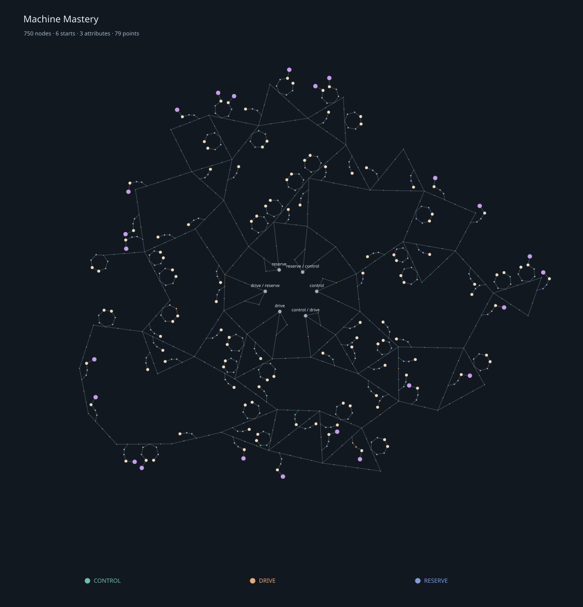

# Machine Mastery

Status: Prototype

Machine Mastery is progression owned by each machine chassis. Machines share one passive graph and enter it at different starting positions. The [implementation matrix](../reference/current-implementation.md) records the current adapters; generator and storage adapters and family ascendancies are deferred.

## Shared tree

The catalog contains 1315 nodes: six starts, 634 attribute travel nodes, 458 ordinary nodes, 186 notables, and 31 keystones, joined by 1464 links. It is built in layers. Inside the six starts, a central junction splits three ways to a core ring, so every machine can path through the middle and reaches the center for the same number of points. Each start opens into a home region with its own road shape between two boundary spokes. A middle ring leads through outer star hubs and climbs to the perimeter road.

Optional reward constellations branch from single road gates: arcs, forks, diamonds, pearl chains, horseshoes, rings, wheels, lattices, crowns, and hexagram stars. Distinct constellations are separated by travel steps. Each notable requires at least three reward allocations from its road gate, and constellations cannot shortcut between roads. Keystones are spread through every layer, either directly on a road or at the end of a reward arm, and always at least 10 points from every start. Silent Operation sits on the center junction, 10 points from every start. Attribute Transfiguration, Singular Drive, and Reserve Actuation sit around the core, where any start can path inward to them. Family keystones sit in the home regions, outer field, and perimeter near their family's start. Output constellations appear on both sides of the tree: Material Memory and Fine Screens mirror the Drive region's Recovery wheels on the Control and Reserve / Control side, with Single Pass on the road between them.

Every paid allocation costs one point and must connect to the machine's start through allocated nodes. Foreign starts cannot be allocated or used as shortcuts. Nodes have no individual level or chassis-stage gates.

| Starting archetype | Initial attributes | Machine adapters |
| --- | --- | --- |
| Control | 20 Control | Metal Press, Resonance Calibrator |
| Control / Drive | 10 Control, 10 Drive | Forestry Companion |
| Drive | 20 Drive | Crusher |
| Drive / Reserve | 10 Drive, 10 Reserve | Furnace, Alloy Furnace |
| Reserve | 20 Reserve | Deferred |
| Reserve / Control | 10 Reserve, 10 Control | Melter |

The Reserve start is present in the graph but has no machine adapter yet. Machines that share a start keep their own progression, but build codes paste between them. Gear and cables do not gain their own Mastery progression.

All nodes remain visible and selectable regardless of machine family. Applicability is evaluated for each effect. A Crusher can allocate maximum heat and gain no heat benefit. An electric Furnace gains no fuel-duration benefit. A node with an irrelevant benefit still applies any relevant penalty; tooltips label inactive effects. The reverse does not happen: a keystone payoff that depends on a family-specific cost is [tagged](#tagged-payoffs), so a machine that escapes the cost does not get the payoff. Relevance highlighting never hides routes.

## Attributes

Control, Drive, and Reserve are point totals. Travel nodes grant flat points; dedicated clusters increase individual attributes or all three attributes. Attribute increases use the same modifier rules as other stats.

Inherent conversions use final, nonnegative attribute totals:

| Attribute | Shared conversion | Family conversion |
| --- | --- | --- |
| Control | 0.1% increased Stability and 0.02% reduced Energy Usage per point | Furnace, Alloy Furnace, and Metal Press: 0.05% increased Temperature Stability per point; Resonance Calibrator: 0.05% increased Calibration Precision per point |
| Drive | 0.15% increased Processing Speed per point | Forestry: +1 Tree Fell Limit per complete 20 points |
| Reserve | Every machine except Forestry: 0.25% increased Energy Capacity per point | Furnace and Alloy Furnace: 0.1% increased Heat Isolation per point; Melter: 0.1% increased Fluid Transfer per point; Forestry: +1 managed-cell maximum per complete 4 points |

Conversions only have a gameplay effect where the receiving stat is used. For example, the primitive fuel Furnace has no FE buffer to benefit from Reserve's energy capacity conversion. Gear and chassis remain the main sources of processing capability.

Explicit attribute scaling is separate. A node can grant an authored percentage per attribute point in addition to inherent conversions. **Attributes grant no inherent bonuses** removes only the conversions in the table: totals, attribute modifiers, and explicit scaling remain. Attribute Transfiguration grants 100% more of each attribute with that restriction. Reserve Actuation uses the same restriction and grants 0.5% increased Processing Speed per Reserve.

Steady State grants 50% more Stability with 15% less Processing Speed. Singular Drive grants 50% more Drive with 50% less Control and Reserve. Lean Grid applies 30% less Energy Usage for machines with an energy buffer and 50% less Energy Capacity. Single Pass disables bonus output and grants 30% more Processing Speed for machines with bonus output. Family keystones are described on each machine page.

Hover the machine's starting node to see current attribute totals. Tool Control retains its separate durability mechanic; these machine conversions do not change tools.

## Tagged payoffs

A tagged effect applies only to machines in its group, and only where the machine uses the stat. Tooltips show the group and its members, and mark the effect inactive on other machines.

| Tag | Machines | Used by |
| --- | --- | --- |
| Heated machines | Furnace, Alloy Furnace, Metal Press | Low Heat Specialist and Flash Annealing speed |
| Crushers | Crusher | Soft Material Specialist speed, Cell Bypass Energy Capacity |
| Machines with bonus output | Crusher, Furnace, Alloy Furnace, Metal Press, Resonance Calibrator | Single Pass speed |
| Machines with an energy buffer | Every family except the Forestry Companion | Lean Grid Energy Usage reduction |

Group membership follows each machine's real stat surface. Heated machines are those whose maximum temperature accepts absolute limits; the Melter is excluded because every Melter recipe needs more heat than those limits allow. Machines with bonus output use Output Amount or Super Output. Only the Crusher reads Output Amount; the other members produce bonus output through Super Output.

Single Pass disables bonus output: Output Amount cannot exceed the base output, and Super Output and Crusher salvage chances drop to zero. It never raises a penalized Output Amount, such as a Crusher running without a Battery Cell.

Untagged penalties still apply everywhere. Flash Annealing's 50% more Energy Usage and Soft Material Specialist's 50% more Energy Usage reach every machine that allocates them, as the Closed Loop Recuperator's speed penalty does.

## Modifier keywords and hard constraints

The canonical operation definitions are in [Affix Generation](affix-generation.md#modifier-operations).

Two 50% reduced modifiers add to 100% reduced. Two 50% less modifiers leave 25%. A 100% less modifier leaves zero even with increased modifiers. “More” and “less” are written as percentages in tooltips and stored as factors in the catalog: `1.5` means 50% more; `0.75` means 25% less.

Fixed values and hard ceilings resolve after ordinary modifiers, including Gear. A fixed maximum temperature of 800 sets it to 800; a ceiling of 800 only prevents exceeding 800. The lower value wins when absolute maximum values conflict. Keystone heat limits are ceilings, so Low Heat Specialist (800) and Flash Annealing (600) never raise a weaker heat source to their limit. A recipe hardness ceiling rejects harder Crusher recipes regardless of installed head or processing level; ordinary under-level recipes retain their existing penalty behavior when no hard ceiling forbids them.

## XP and chassis ownership

Level 1 starts with no points; each level grants one point, so level 100 grants 99 points. Allocation storage, target builds, and build codes hold up to 120 points; the remaining 21 are reserved for a future non-level source. Levels 1–30 retain their previous cumulative XP thresholds. Each cumulative threshold after level 30 is the preceding threshold multiplied by 1.10 and rounded. This is a long-term progression curve, still subject to gameplay balance testing.

Successful work grants `base machine_xp × (1 + floor(band² / 20))`, followed by the band falloff below. Dense Crusher batches and multi-lane Resonance Calibrators award XP per completed job. Failed work, idle placement, output waits, and recipes authored with zero machine XP grant none.

| Machine level relative to work band | XP awarded |
| --- | ---: |
| At or below band | 100% |
| One above band | 50% |
| Two above band | 25% |
| Three or more above band | 0% |

Quarter-XP remainders persist. Positive-XP Crusher recipes derive bands from hardness, and Melter recipes from required processing level on the same scale. Furnace, Alloy Furnace, and Metal Press recipes derive them from target heat, and calibration recipes from the required calibrator stage. Their old 1–25 bands map to 1–98 with `min(98, 1 + floor((oldBand − 1) × 97 / 24))`. An explicitly authored `machine_xp_band` uses the new level scale directly. Forestry uses `min(98, 12 + floor(sqrt(Tree Fell Limit)) × 10)` for completed planting, leaf cleanup, and harvesting actions. Stronger work capability raises its training ceiling. Work in band 98 can eventually reach level 100.

Progression survives supported drops, pick-block, and replacement through `rngtech:machine_progression`. It does not transfer to independently crafted higher-stage chassis. Existing saves preserve XP and earned levels while refunding old machine-specific allocations. New saves store versioned stable node IDs and ordered target builds instead of two node masks. Catalog version 2 replaced the version 1 layout, so version 1 allocations and target builds are refunded and version 1 build codes are rejected.

## Allocating, refunding, and copying

Open Mastery to browse the tree. Drag to pan and scroll to zoom at the cursor; Shift-scroll pans sideways and Ctrl-scroll pans vertically. Toolbar controls expand the view, fit the tree, or return home. Find searches names, IDs, and stat effects, shows the match count, and rings every match so it stays visible when zoomed out; Enter cycles through matches. Matches and relevance highlights use a thick icy white-blue ring. Simulated protanopia, deuteranopia, and tritanopia left it the most distinct from every Mastery accent; red blends into the orange heat accents under red-green color blindness. Entering exactly `keystone`, `notable`, or `travel` (singular or plural) highlights every node of that type instead. The relevance control highlights useful nodes. Hover nodes for exact effects, constraints, and refund instructions.

In the expanded view, the tab on the right edge of the tree opens the **Bonus Summary** drawer. It lists attribute totals, allocated keystones, and every allocated effect combined the way the stat pipeline combines it: increased and reduced add, and more and less multiply. Separate sections show inherent attribute conversions, attribute scaling, limits, special behaviors, and effects this machine does not use. Hover a line to see what the stat does, its current contribution, and the nodes behind it; hover a keystone for its full tooltip. Scroll inside the drawer when it overflows.

Hovering an unallocated node previews the shortest route from your allocations and its point cost. Left-click allocates the whole route in one server action when you can afford it and installed Gear allows every node on it; otherwise nothing is allocated and the tooltip explains why. Allocation happens on release, so a drag that starts on a node only pans. Right-click an allocated node to refund it. Each removed node costs one **Mastery Refund**, crafted eight at a time from paper, redstone, and a copper ingot. Refunds must leave every remaining allocation connected and keep installed Gear legal. Shift-click Clear pays the same per-node price for the whole tree. Creative players do not consume refunds.

Copy stores an ordered build code in the clipboard. Paste requires an empty tree with the same start. It allocates what the destination can afford, then follows the remaining order as that chassis earns points. Purple outlines show target nodes. Pause/Resume controls following. Gear conflicts pause before the illegal allocation; resolve the conflict and resume. Manual refunds pause following. Copying a machine already following a target copies the complete target.

The Configurator has a dedicated Mastery mode. Sneak-use in air toggles between connector and Mastery modes. In Mastery mode, sneak-use a supported machine to copy and use normally to paste. Shift-click Copy in the Mastery screen stores the build on an inventory Configurator and selects Mastery mode. Entity companions use the same workflow.

## Authoring and verification

The checked-in runtime catalog is `src/main/resources/data/rngtech/mastery/machine_tree.json`. `tools/moddex/layout-mega-tree.mjs` deterministically lays out the road layers, keystone placements, and reward constellations without crossings; `author-mega-tree.mjs` assigns attributes, themes, notable names, special notables, and keystones, then writes the catalog and language entries. Later additions go in its `EXTRAS` list, which the layout places after the original fill so existing node IDs, positions, and links stay stable. ModDex reads this catalog directly; its JSON draft and Java layout exports remain authoring views rather than runtime catalog writers. Follow [Passive Tree Design Rules](../reference/passive-tree-design-rules.md) when changing geometry or routes.

Run `node tools/moddex/check-mega-tree.mjs --report` to refresh the [audit report](../reference/machine-mega-tree-audit.json). It includes paths from all starts and representative 99-point builds combining local investment with distant keystones. `masteryCheck`, included in `quickCheck` and `ciCheck`, checks modifier math, migration, build ordering, connectivity, point budgets, attribute suppression, hard constraints, tagged payoffs, the bonus summary, and a keystone audit that fails when a payoff reaches a machine that escapes the keystone's cost. `npm run moddex:check` checks catalog geometry and export consistency.

The implementation has automated domain and graph coverage. In-game interaction, multiplayer synchronization, and late-game balance still need focused playtesting.
