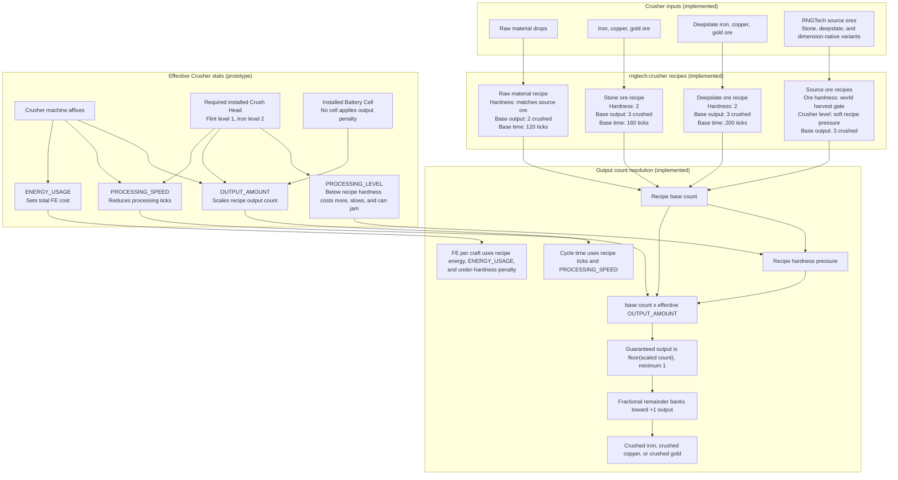

# Stage Progression and Ore Duplication

Status: Prototype

This page includes planned progression targets; sections describing future stages are not registered gameplay.

This page is a schema for how [Component Stages](../reference/component-stages.md), [Crafting and Upgrades](crafting.md), and the [Crusher](../content/crusher.md) connect. It does not replace those canonical rule pages.

## Progression Schema

## Ore Duplication Schema

## Read This As

- Component stages are planned material bands. They set base stat expectations, Refinement Potential expectations, and natural modifier tier weighting.
- The current implemented crusher duplication path is recipe based: raw materials produce `2` crushed items, while Silk-Touched ore blocks produce `3` crushed items.
- RNGTech-owned natural source ores are real blocks for Tin, Zinc, Nickel, Lead, Silver, Aluminum, Osmium, Titanium, Tungsten, Platinum, and Naquadah. Alloy families do not have RNGTech ore or raw forms. Source-ore hardness hard-gates world harvesting with Modular Picks and Hammers; Crusher `required_processing_level` remains separate machine recipe pressure.
- The Crusher requires a valid installed Crush Head before it can process any recipe. That head provides `PROCESSING_LEVEL`; if it is below the recipe's `required_processing_level`, the recipe still runs with extra processing time, extra total FE cost, bonus/proc suppression, and jam risk.
- `OUTPUT_AMOUNT` multiplies the recipe's base count. Fractional results fill the crusher output-bonus bank and produce one extra crushed item when the bank reaches a full item. Under-level Crusher recipes suppress positive `OUTPUT_AMOUNT` above base output.
- `SUPER_OUTPUT_CHANCE` is a separate chance outcome. It can add one extra copy of the base stackable recipe output, but it does not multiply or drain the deterministic `OUTPUT_AMOUNT` bonus bank. Under-level Crusher recipes do not roll Super Output, Instant Process, or Crusher Salvage.
- A Crusher without an installed Battery Cell applies a production penalty to `OUTPUT_AMOUNT`; the tiny internal buffer is an emergency working buffer, not the normal production path.
- `PROCESSING_SPEED` affects throughput without lowering the recipe's base FE cost. `ENERGY_USAGE` affects FE cost, not the recipe's base duplication ratio.
- Crushed items are intermediate outputs. Non-alloy crushed materials can be smelted directly in the `rngtech:furnace` at `600` ticks and `7,200 FE` for Stage 1-4 materials, with Stage 5-8 recipes using authored `2.0x`, `3.0x`, `4.0x`, and `6.0x` FE ramps before runtime high-heat rules.
- Non-alloy crushed materials can also run through the Crusher again to become dust. That Crusher-to-Crusher-to-Furnace chain is faster and cheaper overall at `260` ticks and `6,000 FE` for Stage 1-4 materials, with the same Stage 5-8 authored FE ramps before runtime high-heat rules, while requiring the player to spend on a second processing step.
- RNGTech currently defines manual crushed-to-dust recipes for iron, copper, tin, and gold, Crusher crushed-to-dust recipes for non-alloy crushed materials, source-ore Crusher recipes, and `rngtech:furnace` dust-to-ingot recipes for non-alloy staged material families. Alloy dusts are not part of the default public progression. Bronze has an early blend chain from three Copper Dust, one Tin Dust, and Coal Dust into two Bronze Blend, which then smelts into Bronze Ingots. The Bronze Alloy Furnace can make three Bronze Blend from the same dust ratio plus Charcoal at `900` heat, while the later direct-ingot Bronze recipe makes four Bronze Ingots from the `3:1` Copper/Tin ingot ratio plus Charcoal at `1100` heat.

## Related

- [Component Stages](../reference/component-stages.md)
- [Crafting and Upgrades](crafting.md)
- [Crusher](../content/crusher.md)
- [Machine Stats](../reference/machine-stats.md)
