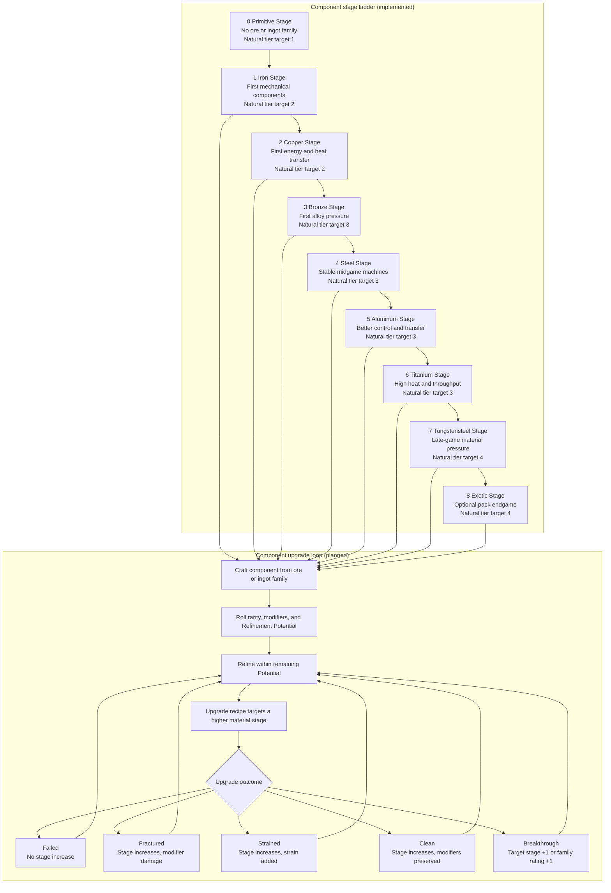
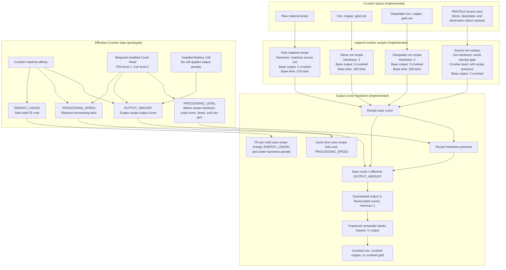

# Stage Progression and Ore Duplication

Status: Prototype

Player guide: [Stages](https://c-pettersson.github.io/rngtech/stages/)

The component upgrade loop below is planned and not registered gameplay; the stage ladder and Crusher duplication path are implemented.

This page is a schema for how [Component Stages](../reference/component-stages.md), [Crafting and Upgrades](crafting.md), and the [Crusher](../content/crusher.md) connect. It does not replace those canonical rule pages.

## Progression Schema

## Ore Duplication Schema

## Read This As

- Component stages set base stat expectations, Refinement Potential expectations, and natural modifier tier weighting.
- Crusher duplication is recipe based: raw materials produce `2` crushed items and Silk-Touched ore blocks produce `3`. Alloy families have no RNGTech ore or raw forms.
- Source-ore hardness hard-gates world harvesting with Modular Picks and Hammers. Crusher `required_processing_level` is separate machine recipe pressure: an under-level Crush Head still runs the recipe with extra time, extra total FE, jam risk, and no bonus output. Under-level recipes suppress positive `OUTPUT_AMOUNT` above base and do not roll Super Output, Instant Process, or Crusher Salvage.
- `OUTPUT_AMOUNT` multiplies the recipe's base count, and fractional results fill the output-bonus bank. `SUPER_OUTPUT_CHANCE` adds one extra base output copy without multiplying or draining that bank.
- A Crusher without an installed Battery Cell applies a production penalty to `OUTPUT_AMOUNT`; the tiny internal buffer is an emergency working buffer, not the normal production path.
- `PROCESSING_SPEED` affects throughput without lowering the recipe's base FE cost. `ENERGY_USAGE` affects FE cost, not the base duplication ratio.
- Balance anchors for Stage 1-4 materials: smelting crushed material directly costs `600` ticks and `7,200 FE`; the Crusher-to-Crusher-to-Furnace dust chain costs `260` ticks and `6,000 FE`, trading a second processing step for lower cost. Stage 5-8 recipes use authored `2.0x`, `3.0x`, `4.0x`, and `6.0x` FE ramps before runtime high-heat rules.
- Default data defines manual crushed-to-dust recipes for iron, copper, tin, and gold, Crusher crushed-to-dust recipes for non-alloy crushed materials, source-ore Crusher recipes, and `rngtech:furnace` dust-to-ingot recipes for non-alloy staged materials. Alloy dusts are not part of the default public progression. Bronze has an early blend chain: three Copper Dust, one Tin Dust, and Coal Dust make two Bronze Blend; the Bronze Alloy Furnace makes three Bronze Blend from the same dust ratio plus Charcoal at `900` heat, and the direct-ingot recipe makes four Bronze Ingots from `3:1` Copper/Tin ingots plus Charcoal at `1100` heat.

## Related

- [Component Stages](../reference/component-stages.md)
- [Crafting and Upgrades](crafting.md)
- [Crusher](../content/crusher.md)
- [Machine Stats](../reference/machine-stats.md)
